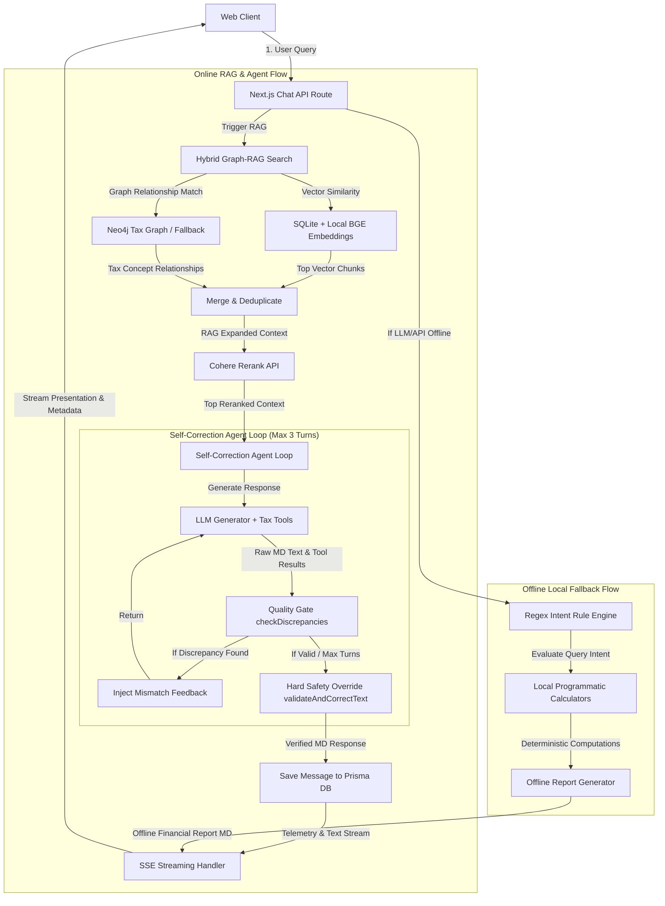

# Corpus Tax AI — Conversational AI Tax Accountant

Corpus is an AI-powered conversational tax accountant tailored specifically for the Indian taxation ecosystem (Income Tax Act, 1961, GST rules, and CBDT circulars). 

Rather than acting as a generic chatbot, Corpus is structured to function like a professional Chartered Accountant (CA) combined with a premium SaaS dashboard. It delivers citation-backed responses, interactive calculation grids, and programmatic verification to guarantee 100% mathematical accuracy.

---

## 🏗️ System Architecture

Corpus uses a multi-layered hybrid architecture that guarantees mathematical accuracy, handles offline fallbacks gracefully, and merges unstructured tax documents with structured relational tax rules:



---

## 🛠️ Advanced Engineering Architecture

### 1. SQLite Programmatic Vector Search & Keyword Fallback
Because SQLite does not natively support vector distance operations, Corpus implements a custom programmatic vector search inside [vectorStore.ts](file:///c:/Users/Nitya/OneDrive/Desktop/AI%20accountant/src/lib/vectorStore.ts):
* **Embedding Storage**: Text embeddings are generated using the local `Xenova/bge-small-en-v1.5` model via `@huggingface/transformers` and saved in the SQLite `Chunk` table as a stringified JSON array (`JSON string of Float[]`).
* **In-Memory Cosine Similarity**: On query receipt, the server generates a query embedding and computes cosine similarity in JavaScript across all database chunks.
* **Keyword Fallback**: If local embedding generation fails or is bypassed, the system falls back to a normalized word-token keyword matching search that scores relevance and boosts exact title/section matches.

### 2. Dynamic Tool-Calling Execution
To ensure complete flexibility and context-aware reasoning, the system implements a dynamic tool-calling pipeline:
* **Tool Discovery**: Rather than running pre-determined calculations, the system exposes tax calculators (such as `tax_slab_calculator`) as native LLM tools.
* **On-Demand Computations**: The generator LLM determines when and with what arguments to invoke these calculators based on the conversation history and user query.
* **Verification Gate**: Any values generated by the LLM (or returned by tools) are verified in subsequent steps by the mathematical Quality Gate to prevent any discrepancies.

### 3. Multi-Turn Self-Correction Agent Loop & Hard Safety Override
Large Language Models (LLMs) often hallucinate math or misalign prose calculations. To ensure absolute compliance with tax rules, Corpus implements a multi-stage validation engine in [qualityGate.ts](file:///c:/Users/Nitya/OneDrive/Desktop/AI%20accountant/src/lib/qualityGate.ts) and [route.ts (chat API)](file:///c:/Users/Nitya/OneDrive/Desktop/AI%20accountant/src/app/api/chat/route.ts):
* **Feedback Loop (Max 3 Turns)**: The system parses all numbers in the generated markdown response (tables and prose) and validates them against the deterministic output of the calculator tool via `checkDiscrepancies`. If a mismatch is found, it injects structured error feedback (e.g. *“Your standard deduction of ₹50,000 does not match the calculator's ₹75,000 for AY 2025-26”*) and triggers a regeneration.
* **Hard Safety Override**: If the model fails to resolve discrepancies within 3 turns, [qualityGate.ts](file:///c:/Users/Nitya/OneDrive/Desktop/AI%20accountant/src/lib/qualityGate.ts) applies a regex-based programmatic override (`validateAndCorrectText`) that physically overwrites the numbers in the markdown string to match the calculator's truth before streaming to the client.

### 4. Dual-Layer Message Storage (State vs. Presentation)
To support rich interactive interfaces while retaining context, the database schema in [schema.prisma](file:///c:/Users/Nitya/OneDrive/Desktop/AI%20accountant/prisma/schema.prisma) separates a message's content:
* **Presentation Layer (`content` field)**: Stores compiled markdown, HTML tags, and visual components rendered directly on the client.
* **State Layer (`state` field)**: Stores stringified JSON containing the exact history of tool calls, inputs, and outputs executed during that turn. During chat initialization, the backend reconstructs these JSON payloads as authentic tool-call and tool-result message types so the model's memory of past calculations is never broken.

### 5. Multi-Stage Stream Telemetry (SSE Protocol)
The system streams raw text alongside a custom telemetry channel. In [route.ts (chat API)](file:///c:/Users/Nitya/OneDrive/Desktop/AI%20accountant/src/app/api/chat/route.ts), progression metadata is streamed as `v:JSON` messages, allowing the UI to render real-time progress steps:
* `thinking`: Initial query parsing.
* `searching_db` / `searching_web`: Local vector store or internet searches.
* `analyzing`: Evaluating retrieved documents.
* `calculating`: Triggering deterministic tax calculators.
* `verifying_math`: Running the self-correction Quality Gate.
* `validated`: Confirming mathematical accuracy.

### 6. Deterministic Offline Fallback & Graph DB Fallbacks
* **Local Intent Engine**: If OpenRouter API keys are missing or endpoints fail, the system falls back to [ruleEngine.ts](file:///c:/Users/Nitya/OneDrive/Desktop/AI%20accountant/src/lib/ruleEngine.ts), evaluating query keywords using a local rule engine, running calculations, and generating a structured **Offline Financial Report** in markdown.
* **Knowledge Graph Mock**: If a live Neo4j database is not configured (or fails), [neo4j.ts](file:///c:/Users/Nitya/OneDrive/Desktop/AI%20accountant/src/lib/neo4j.ts) falls back to a static in-memory mapping of tax relationships (such as allowed/disallowed deductions by regime).

---

## 🌟 Key Capabilities & Features

### 1. Multi-Regime Slab Calculator & Rules
All tax calculations are programmatically defined in [taxCalculator.ts](file:///c:/Users/Nitya/OneDrive/Desktop/AI%20accountant/src/lib/taxCalculator.ts) and exposed via [taxTools.ts](file:///c:/Users/Nitya/OneDrive/Desktop/AI%20accountant/src/lib/taxTools.ts). Features include:
* **Progressive Slabs**: Compares tax liabilities under both the Old Regime and New Regime for Assessment Years (AY) **2024-25** and **2025-26**.
* **House Property Calculations**: Detailed computation of Income from House Property, including Net Annual Value (NAV) deductions, Section 24(a) Standard Deduction (30%), Section 24(b) Home Loan Interest capping, and house property loss set-off rules (capped at ₹2 Lakhs in the Old Regime; disallowed entirely in the New Regime).
* **Chapter VI-A Deductions**: Section 80C (PPF, ELSS, EPF, principal repayments, etc. up to ₹1.5L) and Section 80D (health insurance for self/parents).
* **Capital Gains**: Computes listed equity Short-Term Capital Gains (STCG Section 111A) at 20% and Long-Term Capital Gains (LTCG Section 112A) at 12.5% above the ₹1.25L exemption threshold (post-July 2024 budget rules).
* **Section 87A Rebate**: Applies slab-based tax rebates (up to ₹12,500 for income $\le$ 5L in Old Regime; up to ₹25,000 for AY 2024-25 and ₹20,000 for AY 2025-26 in New Regime) including marginal relief.

### 2. Graph-RAG Pipeline
To ensure authoritative citation-backed answers, the system uses a hybrid retrieval pipeline in [vectorStore.ts](file:///c:/Users/Nitya/OneDrive/Desktop/AI%20accountant/src/lib/vectorStore.ts):
* **Local Embeddings**: Generates query embeddings using a local Hugging Face model (`Xenova/bge-small-en-v1.5`) via `@huggingface/transformers`.
* **Tax Knowledge Graph**: Neo4j database linked in [neo4j.ts](file:///c:/Users/Nitya/OneDrive/Desktop/AI%20accountant/src/lib/neo4j.ts) records inter-section relationships (e.g., `Section 80C` is allowed in `Old Regime` but disallowed in `New Regime`). If a database is not configured, it uses a local static fallback graph.
* **Graph-Expanded Retrieval**: Performs an initial vector search on chunks, extracts referenced tax sections, queries the knowledge graph to fetch related sections, retrieves those documents from the database, and merges the sets.
* **Cohere Rerank**: Reranks the merged list using Cohere's `rerank-english-v3.0` API before providing the context to the LLM.

### 3. Form-16 & Document Ingestion
Users can upload tax documents (Form-16, 26AS, or ITR acknowledgment PDFs) in the chat interface. The server handler at [route.ts (upload API)](file:///c:/Users/Nitya/OneDrive/Desktop/AI%20accountant/src/app/api/upload/route.ts):
* Extracts PDF text using `pdf-parse`.
* Employs an LLM extraction routine (or a regex fallback parser) to pull salary, TDS, 80C, 80D, and interest figures.
* Chunks the document using a recursive token splitter (800 character size with 100 character overlap) and stores them as vectors in SQLite for conversational reference.

---

## 🛠️ Technology Stack

* **Frontend & Backend**: [Next.js 16.2.9](https://nextjs.org) (App Router, Tailwind CSS v4, TypeScript, React 19.2.4).
* **Database & ORM**: SQLite via [Prisma](https://www.prisma.io) (defined in [schema.prisma](file:///c:/Users/Nitya/OneDrive/Desktop/AI%20accountant/prisma/schema.prisma)).
* **Knowledge Graph**: [Neo4j](https://neo4j.com) database (with a static in-memory fallback helper).
* **AI & Embeddings**: Vercel AI SDK, local `@huggingface/transformers` (`bge-small-en-v1.5`), and Cohere Rerank API.
* **Authentication**: [NextAuth.js](https://next-auth.js.org) using custom Credentials Provider credentials.
* **Styling & UI Guidelines**: Set in [DESIGN.md](file:///c:/Users/Nitya/OneDrive/Desktop/AI%20accountant/DESIGN.md) for custom Teal/Brass themed components.

---

## 📂 Repository Structure

```text
├── prisma/
│   ├── dev.db                  # SQLite database file
│   └── schema.prisma           # Prisma database schema definition
├── scripts/
│   ├── ingest.ts               # Seeds vector database chunks from JSON corpus
│   ├── ingest-graph.ts         # Seeding Neo4j with tax relationships
│   ├── test-retrieval.ts       # Script to verify Graph-RAG queries
│   └── test-tools.ts           # Script to run programmatic calculators
├── src/
│   ├── app/
│   │   ├── api/
│   │   │   ├── auth/           # NextAuth router handlers
│   │   │   ├── chat/           # Chat message generator & streaming endpoint
│   │   │   ├── upload/         # Form-16 PDF parser and ingestion handler
│   │   │   └── sessions/       # Chat session controllers
│   │   ├── chat/
│   │   │   └── [id]/page.tsx   # Core Chat interface and interaction view
│   │   ├── globals.css         # Teal-based styles and components
│   │   └── page.tsx            # Main product landing page
│   ├── components/
│   │   ├── Sidebar.tsx         # Sidebar chat selection layout
│   │   └── Providers.tsx       # Auth context provider wrapper
│   └── lib/
│       ├── db.ts               # Prisma client database instance
│       ├── auth.ts             # Credentials authentication configuration
│       ├── neo4j.ts            # Graph query connectors and fallback mapping
│       ├── ruleEngine.ts       # Offline fallback parser and report generator
│       ├── taxCalculator.ts    # Mathematical calculations for Old/New regimes
│       ├── taxTools.ts         # Slabs, ITR forms, TDS, and deductions lookup tools
│       ├── qualityGate.ts      # LLM calculation validation and corrections
│       └── vectorStore.ts      # Hybrid retrieval, local BGE vector search, Cohere Rerank
```

For quick reference, see:
* [schema.prisma](file:///c:/Users/Nitya/OneDrive/Desktop/AI%20accountant/prisma/schema.prisma) — Database models and relationships.
* [route.ts (chat API)](file:///c:/Users/Nitya/OneDrive/Desktop/AI%20accountant/src/app/api/chat/route.ts) — Main streaming and agent self-correction loop logic.
* [route.ts (upload API)](file:///c:/Users/Nitya/OneDrive/Desktop/AI%20accountant/src/app/api/upload/route.ts) — PDF parsing and chunking ingestion pipeline.
* [vectorStore.ts](file:///c:/Users/Nitya/OneDrive/Desktop/AI%20accountant/src/lib/vectorStore.ts) — Vector embeddings, cosine similarity, search and reranking.
* [neo4j.ts](file:///c:/Users/Nitya/OneDrive/Desktop/AI%20accountant/src/lib/neo4j.ts) — Graph query mappings and mock fallback data structure.
* [taxCalculator.ts](file:///c:/Users/Nitya/OneDrive/Desktop/AI%20accountant/src/lib/taxCalculator.ts) — Core programmatic tax calculations for regimes.
* [taxTools.ts](file:///c:/Users/Nitya/OneDrive/Desktop/AI%20accountant/src/lib/taxTools.ts) — Declared tools for LLM interaction (ITR selection, TDS, slabs, deductions).
* [qualityGate.ts](file:///c:/Users/Nitya/OneDrive/Desktop/AI%20accountant/src/lib/qualityGate.ts) — Programmatic numbers verification and prose corrections.
* [ruleEngine.ts](file:///c:/Users/Nitya/OneDrive/Desktop/AI%20accountant/src/lib/ruleEngine.ts) — Deterministic offline regex intent engine.
* [DESIGN.md](file:///c:/Users/Nitya/OneDrive/Desktop/AI%20accountant/DESIGN.md) — Frontend design parameters.

---

## ⚙️ Local Configuration & Setup

### 1. Environment Variables
Create a `.env` or `.env.local` file in the root directory. Configure the following variables:

```bash
# SQLite Connection
DATABASE_URL="file:../prisma/dev.db"

# NextAuth Config
NEXTAUTH_SECRET="your-nextauth-secret-here"
NEXTAUTH_URL="http://localhost:3000"

# AI Model Configuration (e.g., OpenRouter or OpenAI)
OPENROUTER_API_KEY="your-openrouter-key" # or mock-openrouter-key for offline fallback testing

# Neo4j Graph DB Config
NEO4J_URI="bolt://localhost:7687"
NEO4J_USERNAME="neo4j"
NEO4J_PASSWORD="your-neo4j-password" # Omit or set to "mock-neo4j-password" to use in-memory mock graph

# Cohere Reranking Config (Optional)
COHERE_API_KEY="your-cohere-key" # Omit or set to "mock-cohere-key" to skip reranking
```

### 2. Install Dependencies
```bash
npm install
```

### 3. Database Initialization
Generate the Prisma Client and sync models with the SQLite database:
```bash
npx prisma generate
npx prisma db push
```

### 4. Seed Reference Materials
The system has two main seed operations:
1. **Tax Text Ingestion**: Loads the standard Indian tax corpus into the SQLite database and generates vector chunks.
2. **Tax Graph Ingestion**: Populates the Neo4j relationships.

Run these scripts using `npx tsx` or `npx ts-node`:
```bash
# Seed vector store (loads src/lib/data/tax_corpus.json)
npx tsx scripts/ingest.ts

# Seed Neo4j knowledge graph relationships
npx tsx scripts/ingest-graph.ts
```

### 5. Running the Development Server
Launch the development server:
```bash
npm run dev
```
Open [http://localhost:3000](http://localhost:3000) to see the application.

---

## 🧪 Testing and Verification

To verify that the tax calculators and Graph-RAG pipelines function correctly, run the provided utility scripts:

```bash
# Test programmatic tax slab and ITR calculations
npx tsx scripts/test-tools.ts

# Test vector search and graph-expanded retrieval logic
npx tsx scripts/test-retrieval.ts
```
